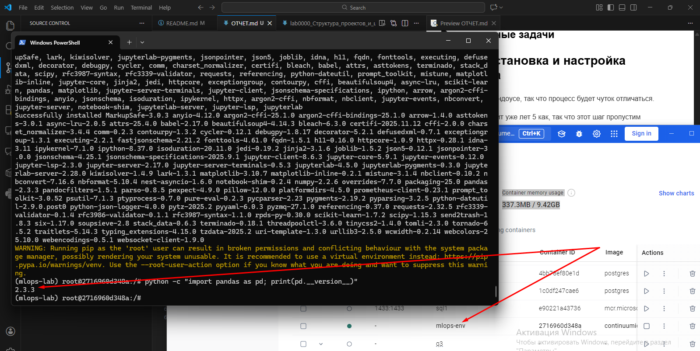
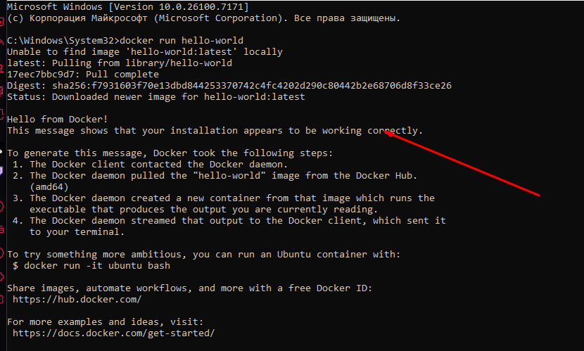
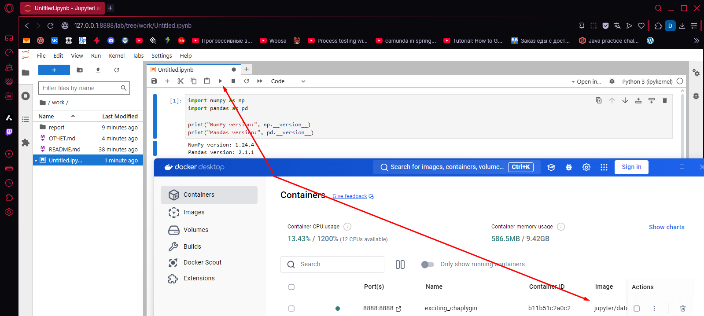
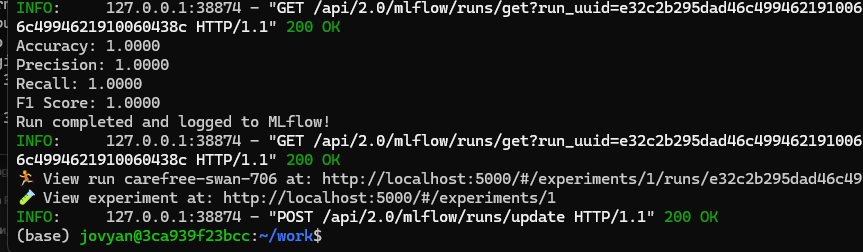

# Отчет по лабораторной работе №1-2, Часть 1
# Подготовка рабочего окружения для MLOps

**Дата:** 2026-09-01
**Семестр:** 3
**Группа:** ПИН-м-о-24-1
**Дисциплина:** Технологии программирования
**Студент:** Рябышева Вероника Валерьевна

## Цель работы
Освоить базовые принципы установки и настройки современного рабочего окружения
для Data Science и MLOps, основанного на дистрибутиве Anaconda (conda) и технологии Docker.
Получить практические навыки управления виртуальными окружениями Python, работы с менеджером
пакетов conda и выполнения основных операций с Docker-контейнерами.

## Теоретическая часть
1. Введение в Conda и виртуальные окружения Современная разработка на Python, особенно в
области анализа данных и машинного обучения, требует управления множеством зависимостей
(библиотек) и их версий. Виртуальное окружение — это изолированное пространство, позволяющее
устанавливать конкретные версии пакетов, не влияя на глобальную установку Python или другие
проекты. Conda — это кроссплатформенный менеджер пакетов и управления окружениями с открытым
исходным кодом. В отличие от стандартного venv, conda может управлять не только Python-пакетами,
но и бинарными зависимостями (например, библиотеками C/C++), что критически важно для работы
таких пакетов, как NumPy, SciPy или TensorFlow. Anaconda — это дистрибутив Python и R, который
включает в себя conda, множество предустановленных научных пакетов (data science stack) и
графические утилиты. Miniconda — его минималистичная версия, содержащая только conda, Python и
небольшой набор базовых пакетов.
2. Введение в Docker Docker — это платформа для разработки, доставки и запуска приложений в
контейнерах. Контейнер — это стандартизированная единица программного обеспечения, которая
инкапсулирует код и все его зависимости, обеспечивая быстрое и надежное выполнение приложения в
любой среде (ноутбук, сервер, облако). Ключевые преимущества:
Изоляция: Приложение в контейнере не зависит от окружения хостовой системы.
Переносимость: Образ, собранный на одной машине, гарантированно запустится на другой.
Повторяемость: Исключается проблема "но на моей машине это работало".
Масштабируемость: Легко запустить несколько экземпляров приложения.


## Практическая часть


##  Этап 1: Установка и настройка Miniconda 
ВДля демонстрации используется Docker-контейнер с готовым окружением Conda:

```bash
docker run -it --name mlops-env continuumio/miniconda3:latest /bin/bash
```

Выполняем команды:
```bash
conda create -n mlops-lab python=3.10 -y
conda activate mlops-lab
pip install numpy pandas scikit-learn matplotlib jupyterlab
python -c "import pandas as pd; print(pd.__version__)"
```
В результате окружение успешно создано, установлены основные библиотеки и проверена их работоспособность.

Использование Docker-контейнеров с Conda позволяет быстро и безопасно создавать изолированные окружения для экспериментов, полностью исключая конфликты зависимостей и влияния на хостовую систему.


## Этап 2: Установка Docker и базовые операции
Проверка установки Docker:
Выполним
```bash
docker run hello-world
``` 

Запустим Jupyter Notebook в контейнере:

```bash
docker run -p 8888:8888 -v ${PWD}:/home/jovyan/work jupyter/datascience-notebook:latest
```
Перейдём по ссылке, вставим код:
```python
import numpy as np
import pandas as pd

print("NumPy version:", np.__version__)
print("Pandas version:", pd.__version__)
```
Проверка доступности библиотек в ноутбуке:


Вывод: Docker обеспечивает надежную и воспроизводимую среду для работы с Jupyter и Python-библиотеками, что особенно полезно для проектов Data Science и MLOps.

# Отчет по лабораторной работе №1-2, Часть 2: 
# Основы трекинга экспериментов с использованием MLflow

**Дата:** 2026-09-01
**Семестр:** 3
**Группа:** ПИН-м-о-24-1
**Дисциплина:** Технологии программирования
**Студент:** Рябышева Вероника Валерьевна

## Цель работы
Освоить базовые принципы работы с платформой MLflow для управления жизненным
циклом машинного обучения (MLOps). Получить практические навыки логирования параметров,
метрик и артефактов вычислительного эксперимента, а также организации их хранения, визуализации и
сравнения.

## Теоретическая часть

1. Введение в MLOps и MLflow MLOps (Machine Learning Operations) — это совокупность практик,
направленных на автоматизацию и надежность жизненного цикла машинного обучения
(развертывание, мониторинг, управление данными). Ключевая проблема, которую решает MLOps —
обеспечение воспроизводимости, отслеживаемости и управляемости ML-экспериментов. MLflow — это
open-source платформа для управления end-to-end жизненным циклом машинного обучения. Она
включает в себя четыре основных компонента:
MLflow Tracking: API и UI для логирования параметров, метрик, кода и артефактов (графики,
модели) в процессе выполнения ML-кода.
MLflow Projects: Стандартный формат упаковки ML-кода для обеспечения воспроизводимости
на любой платформе.
MLflow Models: Стандартный формат упаковки ML-моделей для упрощения их развертывания с
помощью различных инструментов.
MLflow Model Registry: Централизованное хранилище моделей для управления их жизненным
циклом (staging, production, archiving).
В данной работе focuses на компоненте Tracking.

2. Ключевые концепции MLflow Tracking
Эксперимент (Experiment): Контейнер для группы запусков (например, "Оптимизация
гиперпараметров для модели X").
Запуск (Run): Одно выполнение кода, которое логируется в MLflow. Каждый запуск фиксирует:
Параметры (Parameters): Входные переменные модели (например, max_depth,
learning_rate).
Метрики (Metrics): Количественные показатели качества модели (например, accuracy,
rmse). Метрики могут обновляться по ходу выполнения (эпохам, итерациям).
Артефакты (Artifacts): Файлы любого типа, связанные с запуском (например, графики,
обученная модель, файл с предсказаниями).
Теги (Tags): Произвольные ключ-значения для пометки запусков.
Backend Store: Хранилище (файловая система или база данных), где сохраняются метаданные
запусков (параметры, метрики).
Artifact Store: Хранилище (например, локальная папка, S3) для артефактов.


## Практическая часть

Установка и запуск MLflow:
```bash
pip install mlflow
mlflow server --backend-store-uri sqlite:///mlflow.db --default-artifact-root ./mlruns --host 0.0.0.0 --port 5000 --allowed-hosts "*" --cors-allowed-origins "*" &
```
Создаем файл со скриптом, запускаем и, в результате, получаем: 


Далее, поменяем по заданию оптимизатор на liblinear.
Затем, добавим метрику для кросс-энтропии и поменяем соотношение тренировочных и тестовых данных на 70:30. 
[liblinear](mlflow_basic_liblinear.py)
[расширенный с двумя измененными параметрами](mlflow_basic_extended.py)

Выводы:

- Conda и Docker предоставляют эффективные средства для создания воспроизводимых и изолированных окружений для Data Science и MLOps. Использование Docker-контейнеров упрощает развертывание окружений на любых системах и устраняет конфликты зависимостей.
- Miniconda является удобным инструментом для управления виртуальными окружениями и пакетами Python, позволяя устанавливать как Python-библиотеки, так и бинарные зависимости.
- MLflow Tracking позволяет логировать параметры, метрики и артефакты экспериментов, обеспечивая наглядное сравнение моделей, анализ ошибок и мониторинг результатов.
- Проведенные практические эксперименты подтвердили, что корректная настройка окружения и применение MLOps-инструментов повышают надежность и воспроизводимость научных и инженерных исследований в области машинного обучения.